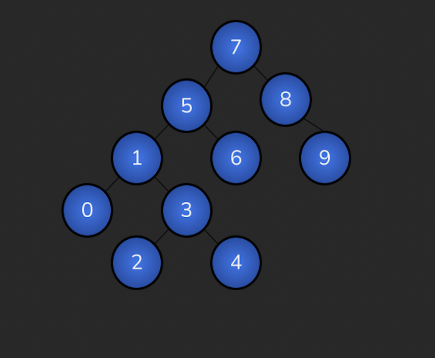

# Veri Yapıları ve Algoritmalar

## Binary Search Tree

[7, 5, 1, 8, 3, 6, 0, 9, 4, 2] dizisinin Binary-Search-Tree aşamalarını yazınız.
Örnek: root x'dir. root'un sağından y bulunur. Solunda z bulunur vb.

Root değer 7 olarak alınır. Ardından ağaca eklenecek sayı bu değerden küçük ise 7 nin sol tarafına büyük ise sağ tarafına gelecek şekilde konumlandırılır. İkinci sayı olan 5, 7 nin soluna yazılır. 1 sayısı 7 den küçük olduğu için ağacın sol tarafından devam edilir. Daha önce bağlanan 5 sayısından küçük olan 1 sayısı da 5’in sol altında yer alır. 8 sayısı 7 den büyük olduğu için ağacın sağ tarafına bağlanır. 3 sayısı 7 den küçük olduğu için ilk aşamada sol taraf, 5 ten küçük olduğu için ikinci aşamada da sol taraf, 1den büyük olduğu için birin altına sağ tarafa yazılır. 6 sayısı, 7 den küçük 5 ten büyük olduğu için, 5 in alt sağ kısmına yazılır. 0 sayısı bu aşamaya kadar yazılan en küçük sayı olduğu için ağaçta karşılaşılacak tüm sayıların solundan ilerlenir. En son 1 sayısının soluna bağlanır. 9 sayısı da şimdiye kadarki ağaca bağlanacak en büyük sayı olacağı için, ağacın sağından devam edilip, 8 sayısının sağ alt kısmına bağlanır. Bir sonraki 4 sayısı 7 den küçük olduğu için sol, 5 ten küçük olduğu için bir daha sol, 1 den büyük olduğu için sağ ve o noktadaki 3 sayısından da büyük olacağı için 3 sayısının sağ alt tarafına bağlanır. Son sayı olan 2 sayısı da kendisinden küçük olan bir sayısına kadar ağacın sol tarafını takip edecek, ardından o noktadaki 3 sayısından küçük olduğu için sol tarafta yer alacaktır.

patika profil linki: https://app.patika.dev/kingcrimson
